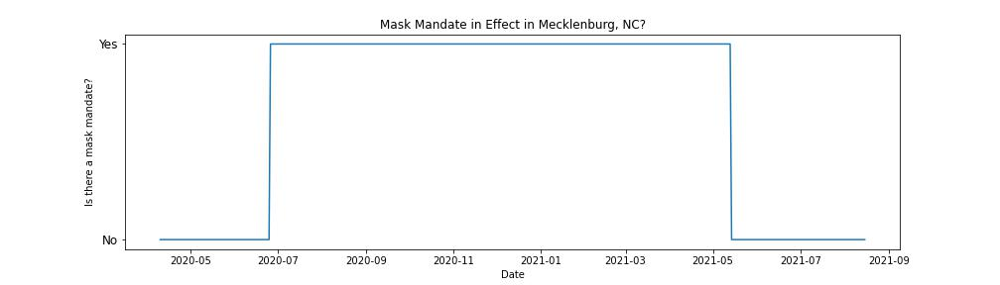
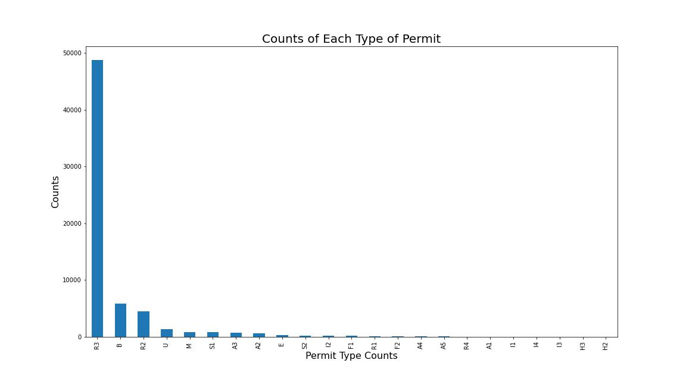
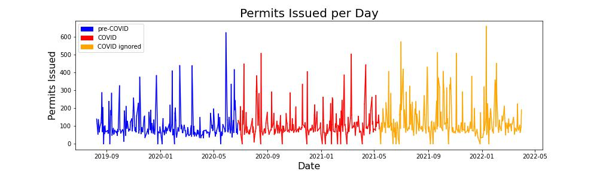

# Mecklenburg-NC-COVID-Building-Permits

This repository contains the necessary data files, notebooks, written report, and visualizations required to reproduce the DATA 512 final project. The purpose of this project is to extend the work from [part one of the project](https://github.com/rafrisci/data-512-project) where the COVID-19 cases for Mecklenburg, North Carolina from February 1, 2020 through October 1, 2021 were analyzed to determine what impact masking had on new cases. The goal of this extension is to determine if the different stages of COVID impacted Mecklenburg, NC's approval of residential building permits.

The mask mandate data comes from [the CDC](https://data.cdc.gov/Policy-Surveillance/U-S-State-and-Territorial-Public-Mask-Mandates-Fro/62d6-pm5i) to determine the different stages of COVID in the county, and the building permit issuance data comes from [Mecklenburg County Open Data](https://meck-ent-power-bi-reports-public-web.azurewebsites.net/Viewer?groupId=2ca2c01c-5658-4ee2-8a4f-5bdda8be94b7&reportId=6a4603a2-d1d1-47b7-9898-3575ed3758c6). The full CDC mask mandate dataset is not in the repository as it was too large. Instead the dataset present is the CDC data filtered specifically for Mecklenburg, NC. The permit issue data is also loaded in the repository across three different files due to the size.These datasets can be found in the data folder.

The [date_range_for_collection.ipynb](./date_range_for_collection.ipynb) notebook uses Mecklenburg mask mandate periods to determine the date range for the permit data pull and different COVID stages.

The [exploring_and_cleaning_building_permit_data.ipynb](./exploring_and_cleaning_building_permit_data.ipynb) notebook filters out permits for nonresidential buildings, and determines the most accurate way calculating housing units approved for construction.

The [analysis.ipynb](./analysis.ipynb) notebook contains the visual and statistical analysis on the cleaned permit data to determine if COVID stages changed how the county approved residential building permits.

A full write-up of the steps and results of this project can be found in written_report.pdf.
